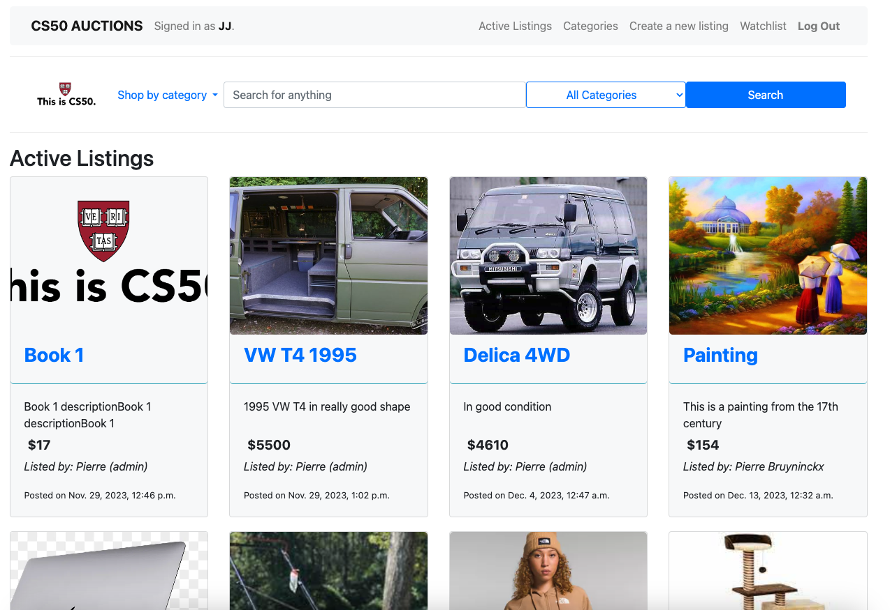
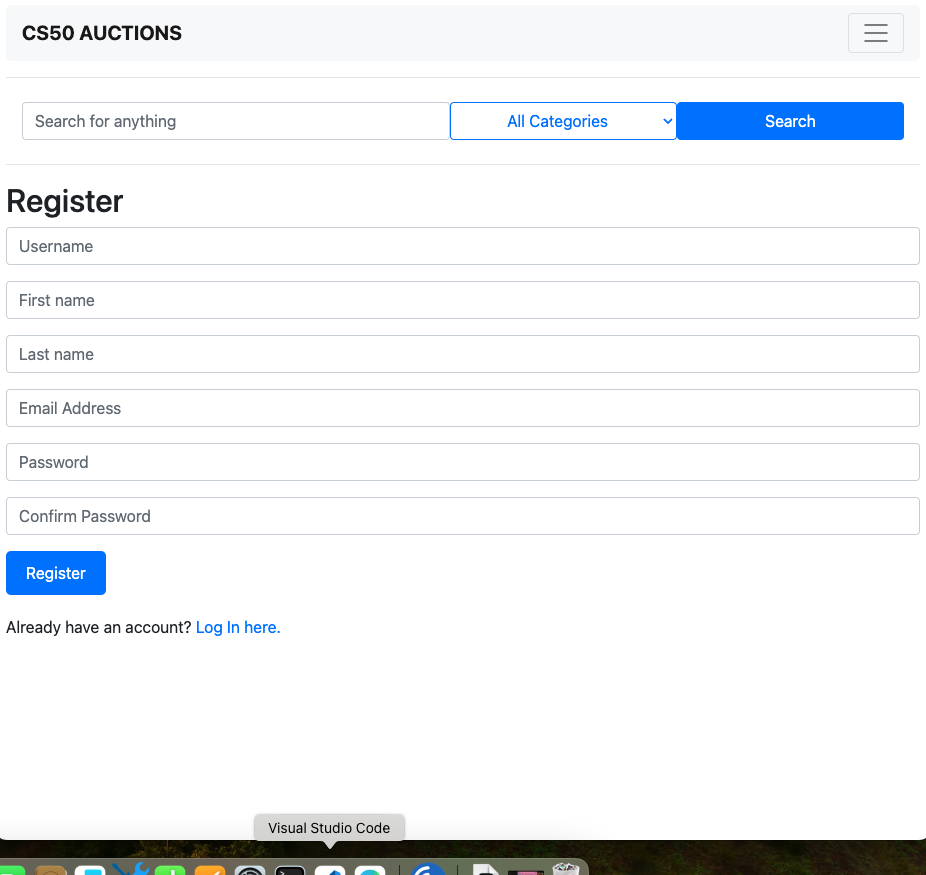
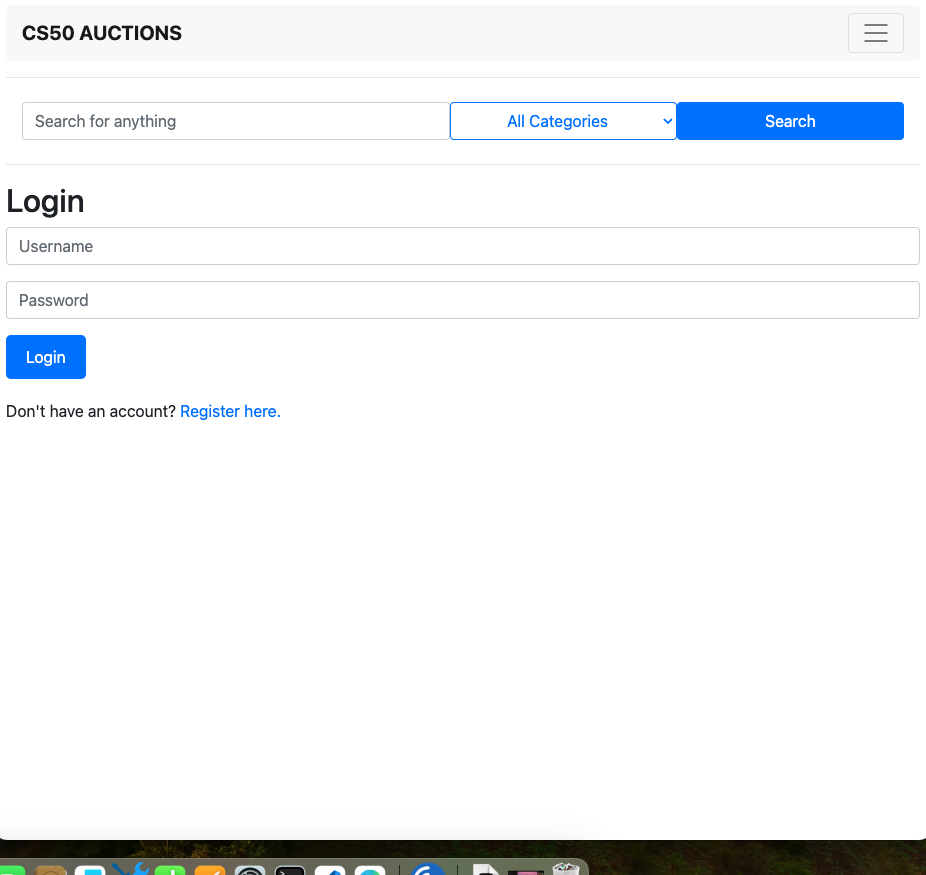
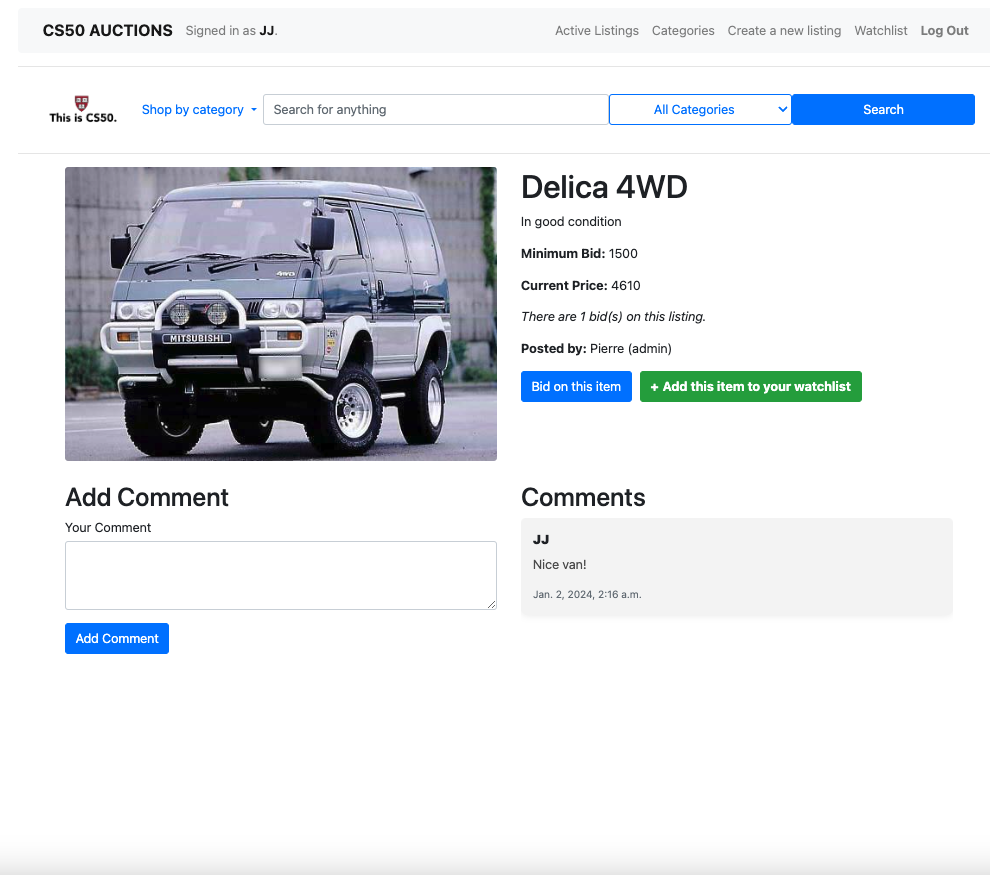

# CS 50 Web: Commerce
Video description: https://youtu.be/8DlRTCO04yA
A mock-up auction marketplace, built in the Django framework

## Description
On this web application, users can create a user account. Once logged in, the user will have the ability to create new listings, which will appear on the active listings page.
User can bid on listings, comment on listings, and add listings to their watchlist.
If a user who owns a certain listing wants to close the listing, they can do so and the user who had the highest bid on the listing will be the winner of it.

### Register
Users can register for an account in this page. Users are required to fill in some basic information to create a profile.

### Log in
Here, users can log in to the web application. Once logged in, users will have access to the full functionality of the web application. Users who are not logged in will only be able to see active listings and the different listing categories, but will not be able to place any bids, comment or add listings to their watchlist.

### Listing overview
On the index page, users can see all the active listings, along with an image and some basic information about the listing. Clicking on any of those listings will lead to the listing page, where users can see all the information about the listing and can bid on the listing or add it to their watchlist.

### Create a listing
Here, users can create new listings. They can specify a title, a description, the starting bid price, an image URL and assign the listing to a particular category. 

### Categories
This page gives an overview of all the different categories on the auction web application. Clicking on any of the categories will display all the listings of that category.

### Search function
Users can search for any listing from the search bar.

### Watchlist
Users can add listings to their watchlist. Going to the watchlist section of the web application will list all the listings that a user added to their watchlist.

### Profile
In their profile section, users can see all the listings they added to the web application, all the bids they have placed in the past, access all the auctions they have won and also see all the details of their profile.
